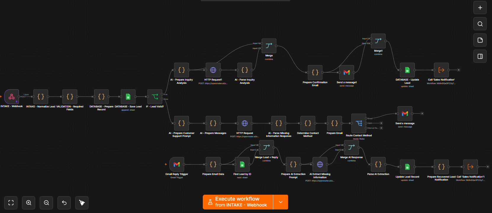

# Universal Lead Processing Automation

> An AI-powered lead management system built with n8n that automates lead intake, validation, recovery, AI analysis, and sales notification.

## Overview

This project demonstrates an end-to-end lead processing system designed to reduce manual lead handling and ensure sales teams receive complete, actionable customer information.

The workflow combines **n8n, AI-powered processing, webhooks, Gmail, and Google Sheets** into a unified lead-management automation.

## Workflow Overview



The workflow uses a separate Sales Notification workflow to handle sales-team notifications after a lead has been successfully processed or recovered.

### Key Capabilities

- 🚀 Automated lead intake through webhooks
- ✅ Required-field validation
- 🤖 AI-powered lead analysis
- 📧 Automated customer follow-ups
- 🔄 Invalid lead recovery through email
- 🧠 AI extraction of missing information
- 📊 Centralized lead record management
- 🔔 Automated New Lead and Recovered Lead notifications
- 💬 Original customer messages and replies included in sales notifications
- 🔐 Secure API authentication using n8n credentials

## Business Use Case

When a business receives incomplete leads, staff often have to manually review the submission, contact the customer for missing information, wait for a response, update the lead record, and notify the sales team.

This automation handles that process automatically.

It can:

- Identify incomplete lead submissions
- Determine what information is missing
- Follow up with the customer automatically
- Process the customer's reply
- Extract the missing information using AI
- Update the lead record
- Notify the sales team when the lead is ready for review

---

## What It Does

The automation handles the lead lifecycle from initial submission through sales notification and recovery.

### 1. Lead Intake

The workflow receives new leads through a webhook and prepares the incoming information for processing.

The intake process includes:

- Receiving lead data through a webhook
- Normalizing incoming information
- Validating required fields
- Preparing a structured lead record
- Saving the lead information

---

### 2. Lead Validation

The workflow determines whether the submitted lead contains the required information.

Valid leads continue through the primary processing path.

Invalid leads are routed into a customer follow-up process instead of being immediately sent to the sales team.

This prevents incomplete leads from reaching sales before the required information has been recovered.

---

### 3. AI Lead Analysis

AI is used to analyze incoming lead information and generate structured data that can be used by the rest of the workflow.

The analysis can identify information such as:

- Lead intent
- Lead summary
- Priority
- Relevant customer information
- Missing information

This allows the workflow to transform unstructured customer messages into more actionable lead data.

---

### 4. Invalid Lead Recovery

When required information is missing, the workflow automatically begins a recovery process.

The recovery process:

1. Identifies the missing information.
2. Determines the appropriate contact method.
3. Sends a follow-up message to the customer.
4. Waits for the customer's email response.
5. Processes the customer's reply.
6. Uses AI to extract the missing information.
7. Updates the original lead record.
8. Marks the lead as a recovered lead.
9. Sends the recovered lead to the sales notification process.

This allows incomplete leads to be recovered automatically instead of requiring a sales or support representative to manually follow up.

---

### 5. Sales Notification

Once a lead is ready for sales review, the workflow automatically sends a notification to the sales team.

The notification distinguishes between:

- **New Lead**
- **Recovered Lead**

For recovered leads, the notification includes:

- Original customer message
- Customer reply
- Recovered lead information
- AI-generated summary and intent
- Lead priority

This gives the sales team the context they need without requiring them to manually search through the customer's previous communication.

---

## Architecture

```text
Customer
   │
   ▼
Webhook Intake
   │
   ▼
Normalize Lead
   │
   ▼
Validate Required Fields
   │
   ├─────────────── Valid ───────────────┐
   │                                    ▼
   │                              AI Lead Analysis
   │                                    │
   │                                    ▼
   │                              Sales Notification
   │
   └──────────── Invalid ────────────────┐
                                        ▼
                              AI Missing Information
                                        │
                                        ▼
                                Customer Follow-up
                                        │
                                        ▼
                                  Gmail Reply
                                        │
                                        ▼
                              Extract Missing Data
                                        │
                                        ▼
                               Update Lead Record
                                        │
                                        ▼
                                Recovered Lead
                                        │
                                        ▼
                              Sales Notification
```

## Technology Stack

| Technology | Purpose |
| --- | --- |
| **n8n** | Workflow automation and orchestration |
| **OpenRouter / LLM APIs** | AI-powered lead analysis and information extraction |
| **Gmail** | Customer communication and reply processing |
| **Google Sheets** | Lead record storage and updates |
| **Webhooks** | Lead intake and event triggering |
| **JavaScript** | Data transformation and workflow logic |

---

## Key Automation Features

### Lead Management

- Automated lead intake
- Lead normalization
- Required-field validation
- Structured lead record creation
- Lead status management

### AI Processing

- Lead intent analysis
- Lead summarization
- Priority classification
- Missing-information detection
- AI-powered extraction from customer replies

### Lead Recovery

- Automated customer follow-up
- Gmail reply monitoring
- Missing-information extraction
- Original lead record recovery
- Recovered lead classification

### Sales Operations

- Automated sales notifications
- New Lead vs. Recovered Lead identification
- Original customer message visibility
- Customer reply visibility
- AI-generated lead context

---

## Security

API credentials are stored using **n8n credential management** rather than being hard-coded directly into workflow nodes.

The OpenRouter API authentication used by the workflow is managed through an n8n credential shared by the relevant HTTP Request nodes.

Sensitive credentials, API keys, tokens, and secrets should never be committed to source control.

The workflow included in this repository is intended as a **portfolio/demo reference** and requires the appropriate credentials and configuration before deployment.

---

## Production Considerations

Before deploying this workflow for a production business environment, additional improvements should be considered, including:

- Production-grade database infrastructure
- Reliable email delivery
- Error handling and retry mechanisms
- Execution logging and monitoring
- Rate-limit handling
- Secure environment configuration
- Webhook authentication
- Production-grade AI models
- Backup and recovery procedures
- Data privacy and compliance requirements
- Monitoring and alerting for workflow failures

These improvements would help transition the workflow from a functional automation prototype into a more robust production system.

---

## Business Value

A workflow like this can help businesses reduce manual lead-processing tasks by automating repetitive operations across the lead lifecycle.

Instead of requiring a team member to manually:

1. Review every incoming lead
2. Check whether required information is missing
3. Contact incomplete leads
4. Monitor customer replies
5. Extract missing information
6. Update lead records
7. Notify the sales team

the automation coordinates these steps automatically.

The result is a more consistent lead-handling process and a sales team that receives more complete information when a lead is ready for review.

---

## Project Goal

The goal of this project is to demonstrate how **AI and workflow automation can be combined to create an end-to-end lead management system**.

The workflow focuses on reducing repetitive administrative work while ensuring that sales teams receive complete and actionable lead information.

---

## Project Structure

```text
universal-lead-processing/
│
├── workflows/
│   └── universal-lead-processing.json
│
└── README.md
```

---

## Important Note

This repository contains an exported n8n workflow for demonstration and portfolio purposes.

The workflow may require additional configuration before it can be deployed in another environment, including:

- n8n credentials
- AI provider credentials
- Gmail configuration
- Google Sheets configuration
- Webhook configuration
- Environment-specific settings

Do not import the workflow into a production environment without reviewing and configuring the required credentials and settings.

---

## Future Improvements

Potential future improvements include:

- CRM integrations
- Advanced lead scoring
- Multiple communication channels
- Slack or Microsoft Teams sales alerts
- Production database integration
- Analytics dashboards
- Automated lead assignment
- Follow-up scheduling
- Human-in-the-loop approval workflows
- Advanced monitoring and error recovery

---

**Built with n8n and AI-powered automation.**
